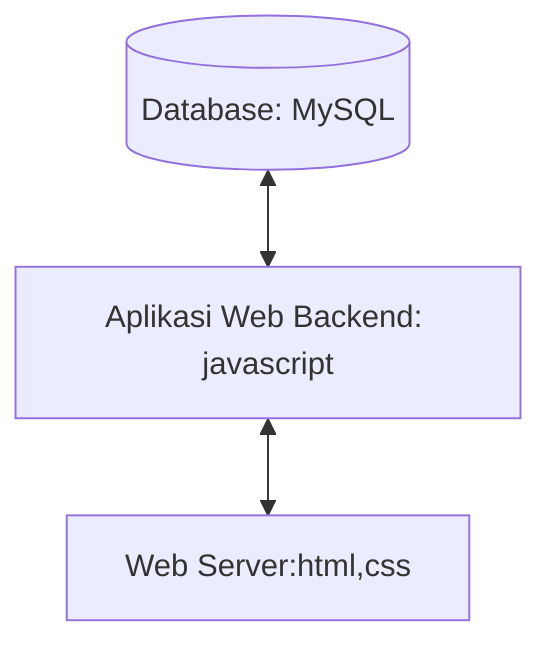

# 1.1 Latar Belakang
With my background as a fast food trader in a 2-month job selling kebabs, burgers, and hotdogs, I have gained experience and understanding of the challenges and needs in the fast food industry. This experience has benefited me especially in stock management, customer management, and effective marketing strategies.Dengan latar belakang saya, pernah menjadi pedagang makanan cepat saji yang dalam menjalankan pekerjaan penjualan kebab, burger, dan hotdog selama 2 bulan an, saya telah mendapatkan pengalaman dan pemahaman tentang tantangan dan kebutuhan dalam industri makanan cepat saji. Pengalaman ini memberi maanfaat untuk saya terutama dalam manajemen stok, pengelolaan pelanggan, dan strategi pemasaran yang efektif.
# 1.2 Deskripsi
I plan to develop an innovative information technology solution designed to optimise the operations of fast food merchants. Our platform will include various features, including:

-A sophisticated tool to monitor and manage inventory of ingredients and equipment.

-To provide deep insights into sales trends and overall business performance.

-I as a merchant want to build better relationships with customers and provide a more personalised experience.

-I want to Increase the effectiveness of product promotion and reach new customers.

Saya berencana untuk mengembangkan sebuah solusi teknologi informasi inovatif yang dirancang untuk mengoptimalkan operasional pedagang makanan cepat saji. Platform kami akan mencakup berbagai fitur, termasuk:

-Sebuah alat yang canggih untuk memantau dan mengelola persediaan bahan makanan dan peralatan.

-Untuk menyediakan wawasan mendalam tentang tren penjualan dan performa bisnis secara keseluruhan.

-Saya sebagai pedagang ingin membangun hubungan yang lebih baik dengan pelanggan dan menyediakan pengalaman yang lebih personal.
-Saya ingin Meningkatkan efektivitas promosi produk dan meraih pelanggan baru.
# 1.3 Branding
- merk : A flash (Acoy Flavor Dash)
- Tagline : "Flavor Perfected through Digital Fusion,Cita Rasa yang Disempurnakan melalui Fusi Digital"
- campaign :tempat untuk orang membeli burger,kebab, dan hotdog melalui teknologi informasi
- Target user :
   - orang yang ingin membeli burger
   - u 12+
   - Orang-orang yang mencari makanan cepat saji yang lezat dan terjangkau.
   - Orang-orang yang mencari makanan yang praktis untuk dibawa ke mana-mana.
   - Orang-orang yang mencari makanan yang cocok untuk berbagai acara.
   - Mahasiswa sering mencari makanan cepat saji yang terjangkau dan praktis.
   - Pekerja sering mencari makanan cepat saji yang bisa dibawa ke tempat kerja.
   - Keluarga sering mencari makanan cepat saji yang bisa dinikmati bersama-sama.
- User experience theme:
   - sederhana
   - warna : dominan warna hitam, warna putih dan cream

# 2. User Story

sebagai | saya ingin bisa | sehingga | prioritas
---|---|---|---
Penjual | Menerima pesanan dari pelanggan | bisa dimudahkan untuk pemesananya lewat online | ⭐⭐⭐⭐⭐
Pembeli | Memesan pesanan dari daftar menu | bisa membuat pesanan yang sangat mudah dan praktis lewat online | ⭐⭐⭐⭐⭐
Pembeli | Melakukan pemesanan burger secara online | Mudah dan cepat mendapatkan burger yang diinginkan | ⭐⭐⭐⭐
Pembeli | Melihat daftar menu dan harga | Dapat memilih burger yang sesuai dengan selera dan budget | ⭐⭐⭐
Pembeli | Menambahkan atau mengurangi topping | Dapat menyesuaikan burger sesuai dengan selera | ⭐⭐
Pembeli | Menonaktifkan fitur notifikasi saat memesan burger | Tidak terganggu oleh notifikasi saat sedang bekerja atau melakukan aktivitas lainnya | ⭐
Penjual | Menerima notifikasi pesanan | Dapat segera menyiapkan burger yang dipesan | ⭐⭐⭐⭐
Penjual | Melihat detail pesanan | Dapat memastikan bahwa pesanan sesuai dengan keinginan pelanggan | ⭐⭐⭐
Penjual | Mengirimkan pesananP| pelanggan dapat menerima burger dengan cepat dan tepat | ⭐⭐
Penjual | Menerima pembayaran	| Dapat melacak pembayaran yang telah diterima | ⭐
Pembeli | Membayar pesanan secara online | Tidak perlu membawa uang tunai saat memesan burger | ⭐⭐⭐
Pembeli | Mengubah atau membatalkan pesanan | Dapat menyesuaikan pesanan jika terjadi perubahan rencana | ⭐⭐
Penjual | Menerima notifikasi perubahan atau pembatalan pesanan | Dapat segera menyesuaikan persiapan pesanan | ⭐ 
Penjual | Menawarkan promo atau diskon | Menarik lebih banyak pelanggan | ⭐⭐
Penjual | Mengirimkan notifikasi kepada pelanggan saat pesanan siap diambil atau dikirim	 | Pelanggan dapat mengetahui status pesanan mereka | ⭐

# 3. Struktur Data

## 4 Arsitektur Sistem

# 5. Teknologi, Library, dan Framework
Saya memakai teknologi yang memudahkan saya dalam membuat web aplikasi antara lain sebagai berikut:
- 1.2.1 mysql
  - MySQL adalah sebuah sistem manajemen database yang dapat digunakan untuk membuat, menyimpan, dan mengelola data. MySQL menggunakan model relasional untuk menyimpan data, yaitu data dikelompokkan dalam tabel-tabel yang saling berhubungan. Setiap tabel memiliki kolom-kolom yang menyimpan data dari satu jenis tertentu.Fungsi utama MySQL adalah untuk menyimpan dan mengelola data. MySQL dapat digunakan untuk berbagai keperluan, seperti:
- Menyimpan data untuk website atau aplikasi web
- Menyimpan data untuk aplikasi desktop atau mobile
- Menyimpan data untuk keperluan bisnis
- 1.2.2 Figma
    - Figma adalah sebuah aplikasi yang dimana kita bisa membuat desain ux/ux untuk sebuah aplikasi atau pun perancangan dan yang lain nya, figma juga menyiapkan yang namanya community untuk sebagai referensi untuk membuat sebuah desain
- 1.2.3 Visual Studio Code
   - Visual studio code adalah sebuah aplikasi adalah sebuah software editor code yang dimana kita bisa membuat program di visul studio code tersebutdan bisa diinstal di berbagai desktop

# 6. Desain User Experience dan User Interface
https://www.figma.com/file/sd5qkInLGAZBTM2bJUVMAm/Untitled?type=design&node-id=0%3A1&mode=design&t=fUFYCIl47QVWEO8C-1
- **Halaman Awal**
- 
- **Halaman Deskripsi**
- 
- **Halaman Menu**
- 

## 7. Demonstrasi Video

## 8. Bagaimana mesin komputasi dan sistem operasi berperan dalam produk teknologi informasimu ?

## 9. Bagaimana algoritma, struktur data, dan bahasa pemrograman berperan dalam produk teknologi informasimu ?

## 10. Bagaimana metode pengembangan perangkat lunak / Software Development Life Cycle berperan dalam produk teknologi informasimu ?
secara umum Proses Pembangunan Teknologi Informasi mengikuti Web Development Life Cycle :
-Pada fase desain, saya akan menggunakan berbagai alat dan teknik desain untuk mendesain arsitektur dan antarmuka produk. Hal ini membantu saya untuk membuat produk yang mudah digunakan dan menarik bagi pengguna.
-Pada fase implementasi, saya akan menggunakan berbagai bahasa pemrograman dan framework untuk membangun produk. Hal ini membantu saya untuk membangun produk yang berkualitas tinggi dan sesuai dengan persyaratan.
-Pada fase pengujian, saya akan menggunakan berbagai metode pengujian untuk menguji produk. Hal ini membantu saya untuk memastikan bahwa produk memenuhi persyaratan dan berfungsi dengan baik.
Pada fase penerapan, saya akan bekerja sama dengan tim DevOps untuk menerapkan produk ke lingkungan produksi. Hal ini membantu saya untuk memastikan bahwa produk dapat digunakan oleh pengguna

## 11. Bagaimana database / sistem basis data berperan dalam produk teknologi informasimu ?

